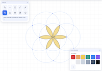

# Computer Aided Geometry (CAG)

Browser-based compass-and-straightedge construction tool for drawing geometric constructions with infinite lines, full circles, inked boundaries, and flood-filled regions.

Live app: [https://emh.io/cag](https://emh.io/cag)



## What It Does

- Draw infinite construction lines and full circles.
- Snap to intersections and nearby geometry for precise placement.
- Ink segments/arcs between intersections to define boundaries.
- Fill enclosed regions with color.
- Pan, zoom, undo/redo, and delete geometry with dependency cleanup.
- Copy and paste a geometric measure distance.

## Controls

- `1` Compass
- `2` Straightedge
- `3` Ink
- `4` Fill
- `5` Copy Measure
- `6` Paste Measure
- `7` Select
- `Z` Undo
- `Y` Redo
- `X` Clear all
- `0` Reset view
- `Space` + drag to pan (or middle-mouse drag)
- Mouse wheel to zoom

## Local Development

This project is plain HTML/CSS/JS and runs directly in the browser.

1. Clone the repo.
2. Open `index.html` in a browser, or serve the folder with any static file server.

Example:

```bash
python3 -m http.server 8080
```

Then open `http://localhost:8080`.

## Tech

- JavaScript
- Preact + Signals
- Full-screen HTML canvas

## License

MIT. See `LICENSE`.
